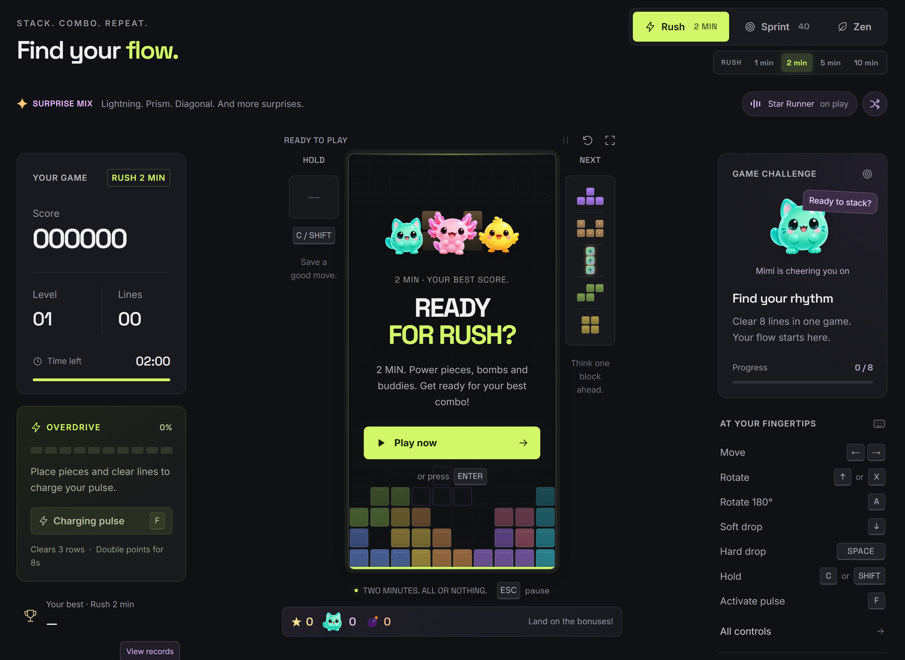

<div align="center">

# ⚡ STACK RUSH ⚡

### *Stack. Combo. Repeat. Find your **flow**.*

**Falling blocks, lightning, exploding bombs, tiny buddies to rescue, and a banging arcade soundtrack.**
**What could possibly go wrong?** *(Everything. The answer is everything. Also it's great.)*

[](https://dliedke.github.io/StackRush/dist/)



</div>

---

## 🕹️ Insert coin (it's free)

No download. No install. No "please create an account to continue."
Just click and start stacking:

- 🎮 **[Play Stack Rush](https://dliedke.github.io/StackRush/dist/)**

Works on desktop *and* mobile. Swipe, tap, drop, win. 📱

---

## 🏁 Pick your poison

| Mode | Vibe | What's the deal? |
|------|------|------------------|
| ⚡ **Rush** | *Two minutes. All or nothing.* | Race the clock (1, 2, 5 or 10 min) with power pieces, bombs, buddies **and** the exclusive Overdrive pulse. Pure chaos, maximum points. |
| 🎯 **Sprint 40** | *Old-school speedrun.* | The 7 classic pieces. Clear 40 lines. As fast as humanly possible. No gimmicks, no excuses. |
| 🍃 **Zen** | *Breathe in. Stack out.* | All the power pieces, stars and buddies with no timer breathing down your neck. |

---

## 💥 Pieces that do *way* more than fall

Rush and Zen throw a **Surprise Mix** at you. Classic blocks, plus some party guests:

| Piece | What it does |
|-------|-------------|
| ⚡ **Lightning** | Zaps every block in the columns it touches, top to bottom. Vertical hits 1 column, horizontal hits **3**. |
| 🌈 **Prism** | Finds the most common color on the board and makes it *vanish*. Poof. |
| ↘️ **Diagonal** | Slices a diagonal line right across the board. Rotate to pick the angle. |
| 🚀 **Rocket** | Launches on landing and clears every block in its path. Rotate to aim down, left, up or right. |
| 💣 **Bomb** | A **9 × 9** kaboom. Rescues buddies in the blast and sends the leftovers tumbling. |
| 🧩 **Mini, Duo, Corner, Horseshoe** | Weird little shapes for weird little gaps. |

Every so often, a **six-piece streak** queues six identical classic pieces, with a glowing queue and a special sound. Hold still works, and buddy gifts wait until the streak finishes.

🐦 **Birds** fly through empty board space. Hit one with a falling piece, a power, or a click/tap for **300 points × level** (doubled in Overdrive).

Empty the whole board and you get an **ALL CLEAR**... with **fireworks**. 🎆

---

## 🐾 Meet the crew

**Mimi, Lumi and Pip** are cheering you on! (Mostly Mimi. Mimi is *very* supportive.)

Buddies and ⭐ stars pop up on the board. Land a piece on them before they disappear:

- ⭐ **Star** → 200 points × level
- 🐱 **Buddy rescue** → 500 points × level

Some buddies bring... *side effects*. Rescue them and hang on tight:

| Buddy | Special talent |
|-------|----------------|
| 🙃 **Nox** | Flips your world **upside down** for 10s |
| 🏎️ **Turbo** | **Turbo drop!** Pieces fall faster for 10s |
| 📏 **Lino** | **Only I pieces** for 10s (you're welcome) |
| 🔩 **Broca** | **Drill mode:** every piece bores straight to the bottom for 10s |
| 6️⃣ **Sexto** | Lines clear with just **6 blocks** for 15s |

---

## 🎯 A reason for one more round

- **Three missions per game:** hit 3 birds (+750 points), rescue 2 buddies (+1,000), and clear lines with 3 consecutive pieces (+1,500). Sprint swaps birds and rescues for clearing 8 lines and placing 20 pieces. Each reward is paid once per game, at its fixed value.
- **Buddy album:** every rescue is saved on your device. Find all 10 friends, then rescue each one 3 times for an Aurora color, 5 for a crown, and 10 for a heart shower. New looks equip automatically; open the album to choose your favorites. They appear on the board and cheering buddies.
- **Beat your best:** track the gap to your personal record, get a nudge near the target, and celebrate passing it with a fanfare and fireworks. Records stay separate by mode and board size; Sprint compares completed times.

Open **Missions** or **Buddy Album** above the board at any time. The game pauses while you look. The results screen shows completed missions and the next album milestone.

---

## 🔋 OVERDRIVE (Rush only)

Place pieces and clear lines to charge your **pulse**. When it's full, smash **`D`** and:

> 🔥 **Clears 3 rows** · 💰 **Double points for 8 seconds**

Time it with a bonus and watch your score go *brrrrr*.

---

## ⌨️ At your fingertips

| Action | Keys |
|--------|------|
| Move | `←` `→` |
| Rotate | `↑` or `X` |
| Rotate 180° | `A` |
| Soft drop | `↓` |
| Hard drop | `SPACE` |
| Hold | `C` or `SHIFT` |
| Activate pulse | `D` |
| Auto burst (non-stop hard drops, toggle) | `F` |
| Auto burst speed (while it is on) | `+` `-` |
| Pause | `ESC` |

📱 **On mobile:** drag sideways to move, tap to rotate, pull down a bit to soft drop, pull down far to **SLAM** it.

---

## 🎵 Now playing

Three original arcade bangers: **Neon Drive**, **Disco Cometa** and **Star Runner**.
Hit shuffle, crank it up, get in the zone. 🎧

🌎 Speaks **English** and **Português**, picked automatically from your browser.

---

## 🛠️ For the builders

Want to run it locally, hack on it, or just peek under the hood? Here's how.

### Visual Studio 2026

1. Install the **ASP.NET and web development** workload and the **.NET 10 SDK**.
2. Open `StackRush.sln` and pick the `StackRush` launch profile.
3. Hit **F5** (or **Ctrl+F5** without debugging).
4. Your browser opens at `http://localhost:5180`. Go stack something.

### Command line

```powershell
dotnet build StackRush.sln -c Release         # build it
dotnet run --project StackRush.csproj         # run it
node --test tests/*.test.mjs                  # test it (or: npm test)
dotnet publish StackRush.csproj -c Release    # ship it
```

To run the published output, go to `bin/Release/net10.0/publish` and run
`dotnet StackRush.dll --urls http://localhost:5180`.

> 💡 Node.js is only needed for the tests. They're Node tests, so run them in the terminal, not the .NET Test Explorer.

### 🗺️ What's where

```
StackRush/
├── 🎮 dist/                  ← the actual game (web source AND web root)
│   ├── index.html            ← the stage
│   ├── style.css             ← the glow-up
│   ├── app.mjs               ← UI and input handling
│   ├── engine.mjs            ← game rules and state (the brain 🧠)
│   ├── progression.mjs       ← missions, buddy album and personal-best rival
│   ├── journey.css           ← mission cards, album and progress notices
│   ├── i18n.mjs              ← English and Portuguese
│   ├── audio.mjs / tracks.mjs       ← bleeps, bloops and bangers
│   ├── fireworks.mjs / power-fx.mjs ← the shiny stuff ✨
│   └── assets/               ← mascot images (hi Mimi 👋)
├── 🧪 tests/                 ← Node.js tests
├── 🖼️ docs/                  ← README images
├── Program.cs                ← tiny ASP.NET Core host
├── Properties/launchSettings.json
├── StackRush.sln / StackRush.csproj
└── package.json
```

No bundler. No `npm install`. No build step for the game. `dist/` *is* the source.
It's included in .NET builds and publishes as-is.

### 🌐 GitHub Pages

GitHub Pages publishes the `main` branch from `/ (root)`. The game lives in
`dist/index.html`, so the URL includes `/dist/`. The online version serves the
static files directly and doesn't need the ASP.NET Core host.

Static file hosting follows the
[ASP.NET Core documentation](https://learn.microsoft.com/en-us/aspnet/core/fundamentals/static-files?view=aspnetcore-10.0).

---

<div align="center">

### 🏆 Think you can beat your best score?

**[Prove it. ▶](https://dliedke.github.io/StackRush/dist/)**

*Made with ☕, 🧱 and way too many "just one more game" moments.*

</div>
